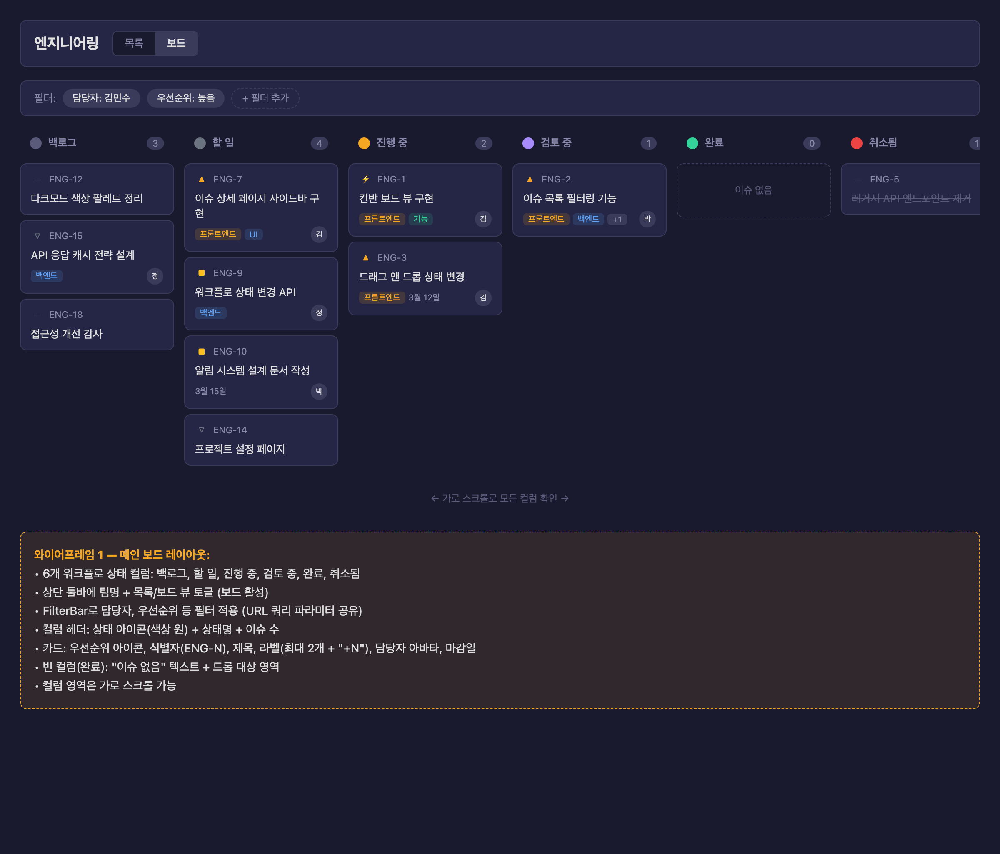
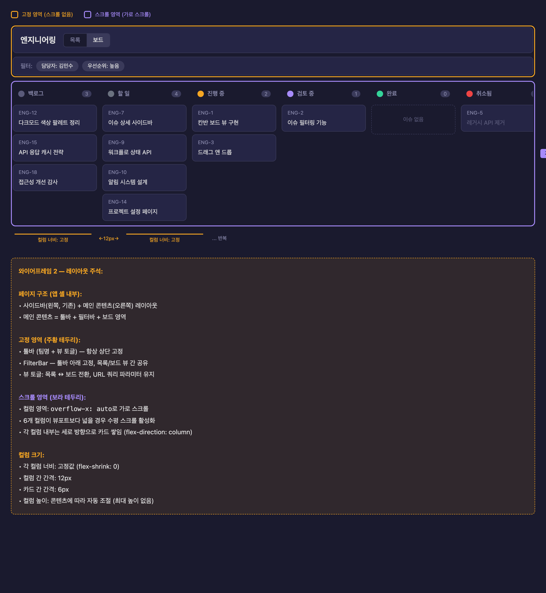
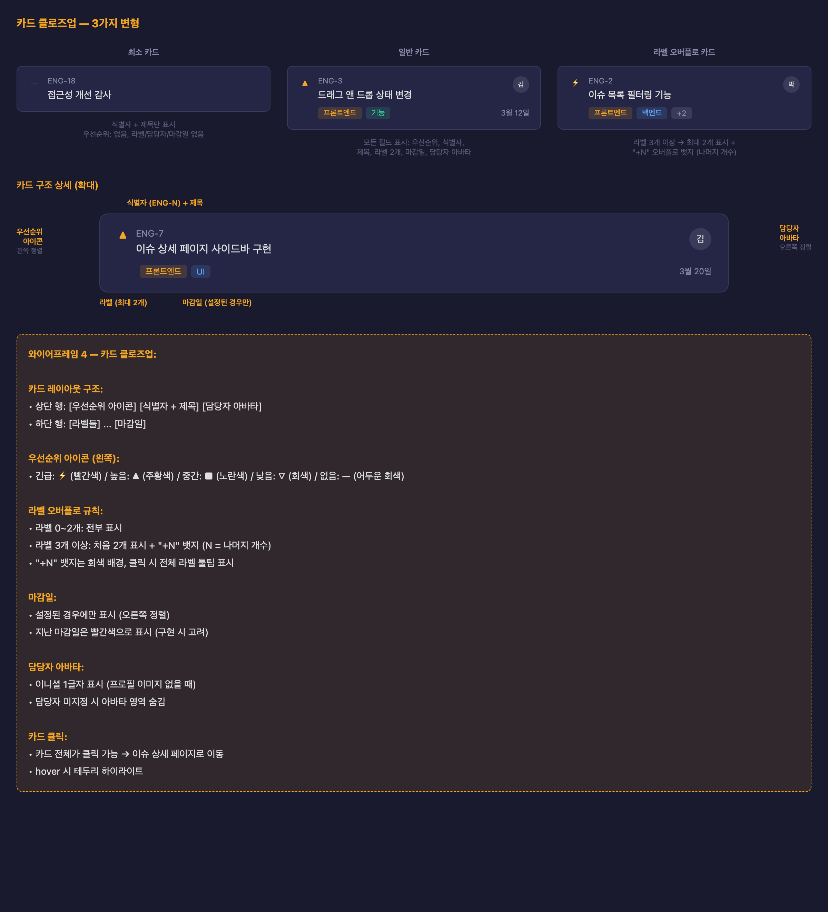
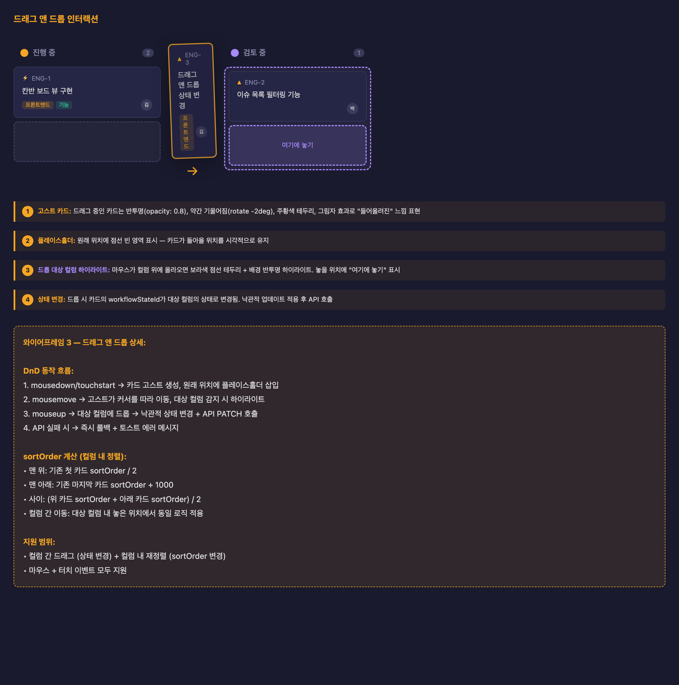
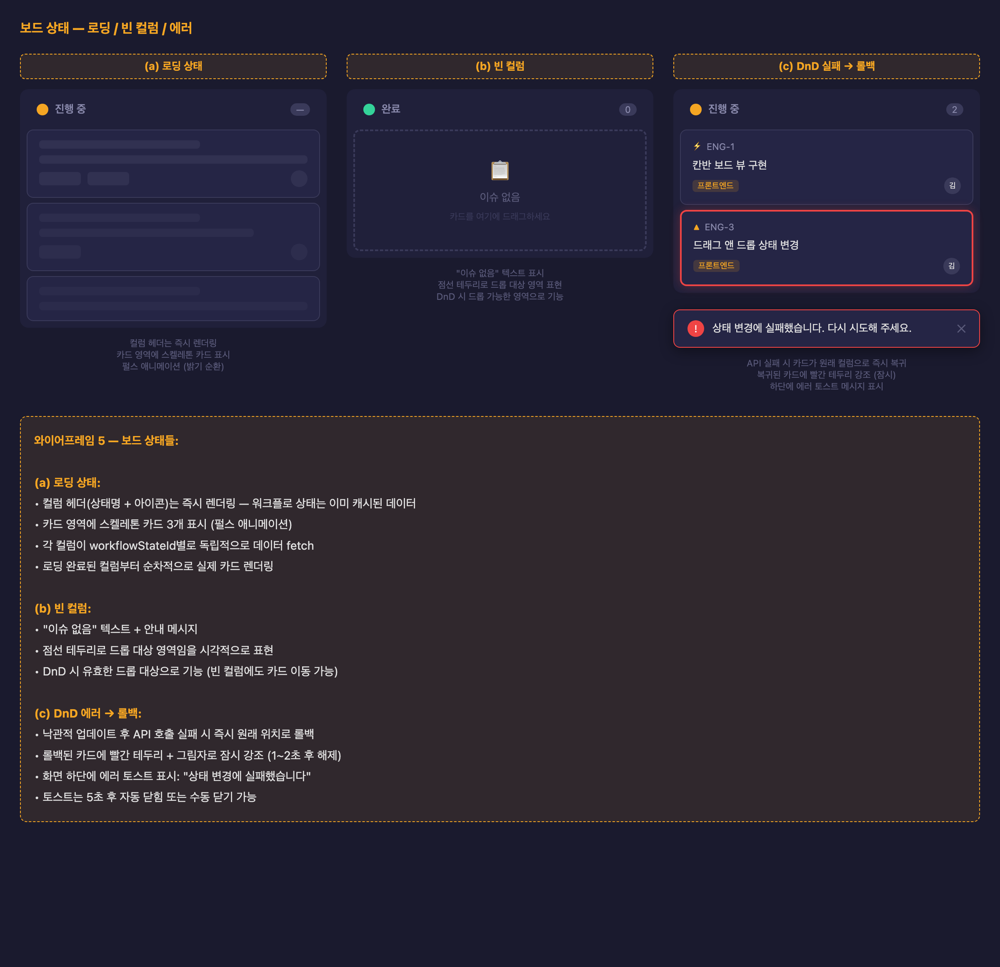

# 칸반 보드

이슈 목록 페이지에서 리스트/보드 뷰를 전환하여 워크플로우 상태별 칸반 보드로 이슈를 관리한다.

> [!NOTE]
> **용어 참고**: UI에서 "상태"로 표시되는 항목은 API에서 `workflowState`에 해당한다. 컬럼 = 워크플로우 상태.

## 목차

- [개요](#개요)
- [범위](#범위)
- [뷰 전환](#뷰-전환)
- [보드 레이아웃](#보드-레이아웃)
- [컬럼](#컬럼)
- [카드](#카드)
- [드래그앤드롭](#드래그앤드롭)
- [필터](#필터)
- [상태 처리](#상태-처리)

## 개요

현재 이슈 목록(`/issues`)은 상태별로 그룹핑된 리스트 뷰만 제공한다. 칸반 보드 뷰를 추가하여 같은 페이지에서 리스트↔보드를 전환할 수 있게 한다.

## 범위

### 이번에 구현

| 항목 | 설명 | 이슈 |
|------|------|------|
| 뷰 전환 토글 | 리스트/보드 뷰 전환 UI (툴바에 배치) | |
| 칸반 보드 컴포넌트 | 워크플로우 상태별 수평 컬럼 레이아웃 | |
| 칸반 카드 | 이슈 정보를 표시하는 카드 컴포넌트 | |
| 컬럼 간 드래그앤드롭 | 카드를 다른 컬럼으로 드래그하여 상태 변경 | |
| 컬럼 내 정렬 | 같은 컬럼 안에서 카드 순서 변경 | |
| 필터 연동 | 리스트 뷰와 동일한 필터 공유 | |
| 리스트 API 라벨 포함 | 이슈 목록 API에 라벨 데이터 포함 | |
| 빈/로딩/에러 상태 | 각 상태별 UI 처리 | |

### 후속 이슈

| 항목 | 설명 |
|------|------|
| 컬럼 숨김/표시 토글 | 특정 상태 컬럼을 숨기거나 표시하는 UI. 숨김 UI 설계가 필요하여 별도 기획 |
| 컬럼 순서 드래그 변경 | 컬럼 헤더를 드래그하여 순서 변경. 보드 기본 기능과 독립적 |
| 카드 퀵 액션 메뉴 | 카드 우클릭/호버 시 상태 변경, 담당자 변경 등 빠른 조작 |
| 보드 키보드 내비게이션 | 방향키로 카드/컬럼 간 이동, Enter로 상세 열기 |
| 필터된 빈 컬럼 시각 구분 | 필터로 인해 빈 컬럼과 원래 빈 컬럼의 시각적 차이 |

### 전제조건

| 항목 | 이유 |
|------|------|
| 워크플로우 상태 CRUD | 이미 구현됨. 컬럼 데이터의 원천 |
| 이슈 CRUD + sortOrder | 이미 구현됨. 카드 데이터 및 정렬의 원천 |
| @dnd-kit 라이브러리 | 이미 설치됨. 리스트 뷰에서 사용 중 |
| 토스트 알림 라이브러리 | 미설치. DnD 에러 알림에 필요 (sonner 등 도입 필요) |

## 뷰 전환

이슈 목록 페이지의 툴바 영역에 리스트/보드 뷰 전환 토글을 배치한다.

- **위치**: FilterBar 왼쪽의 탭 토글 ("목록" / "보드" 텍스트 탭)
- **기본 뷰**: 리스트 (기존 동작 유지)
- **전환 시 동작**: 같은 URL에서 뷰만 변경. URL 쿼리 파라미터로 뷰 상태 저장 (예: `?view=board`)
- **필터 유지**: 뷰 전환 시 적용된 필터가 그대로 유지됨

> [!TIP]
> 뷰 상태는 URL search param `view`로 관리한다. 기본값은 `list`이며, `board`로 전환 시 칸반 보드를 렌더링한다. TanStack Router의 search param validation을 활용한다.

## 보드 레이아웃

### 영역 구분

| 영역 | 스크롤 | 설명 |
|------|--------|------|
| 툴바 + FilterBar | 고정 | 뷰 전환 토글, 필터, 정렬 옵션 |
| 컬럼 영역 | 수평 스크롤 | 워크플로우 상태별 컬럼 나열 |
| 컬럼 내부 | 수직 스크롤 | 카드가 많을 때 컬럼 내부만 스크롤 |

### 컬럼 영역

- 컬럼들이 수평으로 나열되며, 화면에 다 안 들어올 경우 수평 스크롤
- 각 컬럼은 고정 너비 (약 280px), `flex-shrink: 0`
- 컬럼 간 간격: 12px
- 카드 간 간격: 6px
- 컬럼 높이: 콘텐츠에 따라 자동 조절 (최대 높이 없음)

## 컬럼

워크플로우 상태 하나가 칸반 보드의 컬럼 하나에 대응한다. `position` 필드 순서대로 왼쪽부터 나열한다.

### 컬럼 헤더

- **구성**: 상태 아이콘 (색상 원형) + 상태 이름 + 이슈 수
- **상태 아이콘 색상**: 각 워크플로우 상태의 `color` 필드 사용
- **이슈 수**: 현재 필터 기준으로 해당 컬럼에 있는 이슈 수
- **클릭 동작**: 없음 (후속 이슈에서 컬럼 메뉴 추가 가능)

### 데이터 로딩

각 컬럼은 `workflowStateId` 필터를 사용하여 독립적으로 데이터를 fetch한다.

> [!NOTE]
> 컬럼별 독립 fetch를 사용하면 각 컬럼이 독립적으로 로딩/에러 상태를 가질 수 있고, 특정 컬럼의 이슈가 많아도 다른 컬럼에 영향을 주지 않는다. `useIssues` 훅에 `workflowStateId` 필터를 전달하여 구현한다.

## 카드

이슈 하나가 카드 하나로 표시된다.

### 카드 구성 요소

| 요소 | 위치 | 표시 조건 | 설명 |
|------|------|-----------|------|
| 우선순위 아이콘 | 좌상단 | 항상 | 기존 `PriorityIcon` 컴포넌트 재사용 |
| 식별자 | 상단 (아이콘 옆) | 항상 | "ENG-1" 형식, 보조 색상 |
| 제목 | 중앙 | 항상 | 최대 2줄, 초과 시 말줄임 |
| 라벨 | 하단 좌측 | 라벨 있을 때 | 최대 2개 표시 + "+N" 뱃지 |
| 마감일 | 하단 | 마감일 있을 때 | 날짜 형식 표시, 지난 경우 경고 색상 |
| 담당자 아바타 | 우하단 | 담당자 있을 때 | 기존 `Avatar` 컴포넌트 재사용 |

### 카드 인터랙션

- **클릭**: 이슈 상세 페이지로 이동 (`/issue/$issueIdentifier`)
- **호버**: 카드 배경색 약간 밝아짐 + 드래그 가능 커서 (`cursor: grab`)
- **카드 내 요소**: 모두 읽기 전용. 수정은 이슈 상세 페이지에서

### 카드 변형

- **최소 카드**: 식별자 + 제목만 (우선순위 없음, 담당자 미배정, 라벨/마감일 없음)
- **일반 카드**: 모든 요소 표시
- **라벨 오버플로 카드**: 라벨 2개 + "+N" 뱃지

## 드래그앤드롭

### DnD 공통

- **활성화**: 카드를 5px 이상 드래그하면 DnD 시작 (dnd-kit 기본 설정)
- **고스트 카드**: 드래그 중인 카드의 반투명 복제본이 커서를 따라다님
- **플레이스홀더**: 원래 위치에 빈 공간(점선 테두리)으로 카드 자리 표시
- **드롭 취소**: 유효하지 않은 영역에 드롭하면 원래 위치로 복귀

> [!NOTE]
> dnd-kit의 `DragOverlay`를 사용하여 고스트 카드를 렌더링하고, `SortableContext`로 컬럼 내 정렬을 관리한다. 크로스 컨테이너 이동은 `onDragOver` 이벤트에서 컨테이너(컬럼) 변경을 감지하여 처리한다.

### 컬럼 내 순서 변경

같은 컬럼 안에서 카드를 위/아래로 드래그하여 순서를 변경한다.

- **sortOrder 계산**: 이웃 카드들의 sortOrder 중간값 사용 (기존 리스트 뷰 로직 재사용)
- **API 호출**: `PATCH /issues/:identifier` — `sortOrder`만 업데이트
- **낙관적 업데이트**: 드롭 즉시 UI 반영, API 실패 시 롤백

### 컬럼 간 이동

카드를 다른 컬럼으로 드래그하여 이슈의 워크플로우 상태를 변경한다.

- **드롭 대상 컬럼 표시**: 드래그 중 카드가 다른 컬럼 위에 있을 때 해당 컬럼 배경 하이라이트 (테두리 강조)
- **컬럼 드롭 위치 결정**:
  - 빈 컬럼에 드롭: 기본 sortOrder 사용 (첫 번째 카드)
  - 비어 있지 않은 컬럼의 카드 사이에 드롭: 이웃 카드들의 sortOrder 중간값 사용
  - 비어 있지 않은 컬럼의 맨 아래에 드롭: 마지막 카드 아래에 배치
- **API 호출**: `PATCH /issues/:identifier` — `workflowStateId` + `sortOrder` 동시 업데이트
- **낙관적 업데이트**: 드롭 즉시 소스 컬럼에서 제거 + 대상 컬럼에 추가, API 실패 시 양쪽 롤백

> [!NOTE]
> 컬럼 간 이동 시 소스 컬럼과 대상 컬럼 양쪽의 쿼리 캐시를 낙관적으로 업데이트해야 한다. `workflowStateId` 필터별로 별도 쿼리 키를 사용하므로, 두 쿼리 키의 캐시를 동시에 수정한다.

### 에러 처리

- **네트워크 에러**: 카드가 원래 위치/컬럼으로 즉시 복귀 + 롤백된 카드에 빨간 테두리와 고스트 잠시 강조 (1~2초 후 해제) + 토스트 알림 ("상태 변경에 실패했습니다. 다시 시도해 주세요.")
- **롤백 범위**: 컬럼 간 이동 실패 시 소스/대상 컬럼 모두 원래 상태로 복원
- **토스트**: 5초 후 자동 닫힘 또는 수동 닫기 가능

## 필터

기존 `FilterBar` 컴포넌트를 보드 뷰에서도 그대로 사용한다.

- **공유 필터**: URL 쿼리 파라미터로 필터 상태를 저장하므로, 리스트↔보드 전환 시 필터 유지
- **필터 적용**: 각 컬럼의 데이터 fetch 시 필터 조건을 함께 전달
- **필터 가능 항목**: 우선순위, 담당자, 라벨 (기존과 동일)

> [!NOTE]
> 상태 필터(`workflowStateId`)는 보드 뷰에서는 적용 방식이 다를 수 있다. 리스트에서는 특정 상태만 보여주지만, 보드에서는 해당 컬럼만 표시하거나 전체 컬럼을 유지하되 필터된 컬럼을 비활성화할 수 있다. 이번 구현에서는 상태 필터 적용 시 해당 상태의 컬럼만 표시한다.

## 상태 처리

### 로딩

- **컬럼 헤더**: 워크플로우 상태 데이터는 별도 쿼리로 먼저 로딩되므로 헤더가 먼저 표시됨
- **카드 영역**: 각 컬럼 내부에 스켈레톤 카드 3개 표시 (카드 모양의 회색 플레이스홀더)
- **컬럼별 독립 로딩**: 빠른 컬럼부터 순차적으로 실제 카드 표시

### 빈 컬럼

- **표시**: 컬럼 중앙에 "이슈 없음" 텍스트 (보조 색상)
- **드롭 영역**: 빈 컬럼도 DnD 드롭 대상으로 동작. 드래그 오버 시 점선 테두리 + "여기에 놓기" 텍스트로 드롭 가능 영역 표시

### 에러

- **데이터 로딩 에러**: 해당 컬럼에 에러 메시지 표시 + 재시도 버튼
- **DnD 에러**: 카드 원래 위치로 즉시 복귀 + 빨간 테두리 강조 (1~2초) + 토스트 알림
