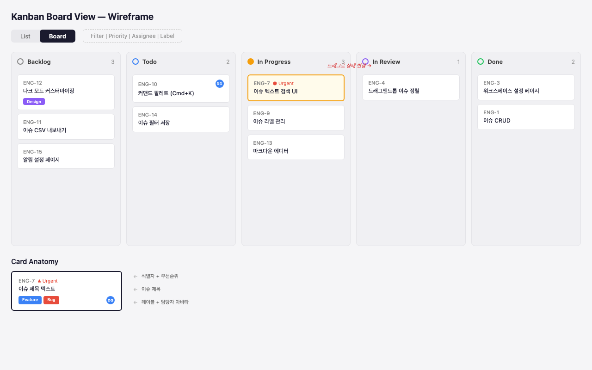
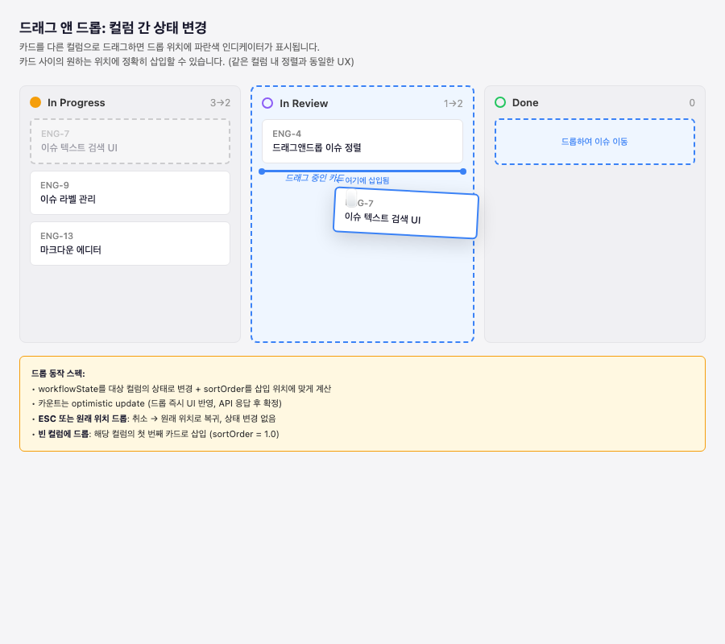
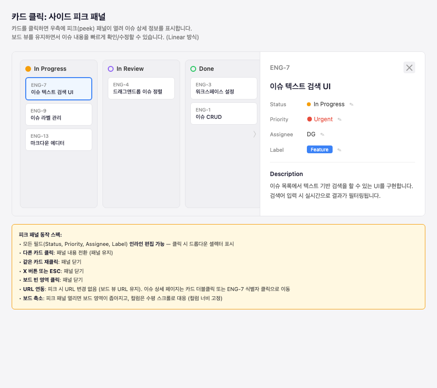
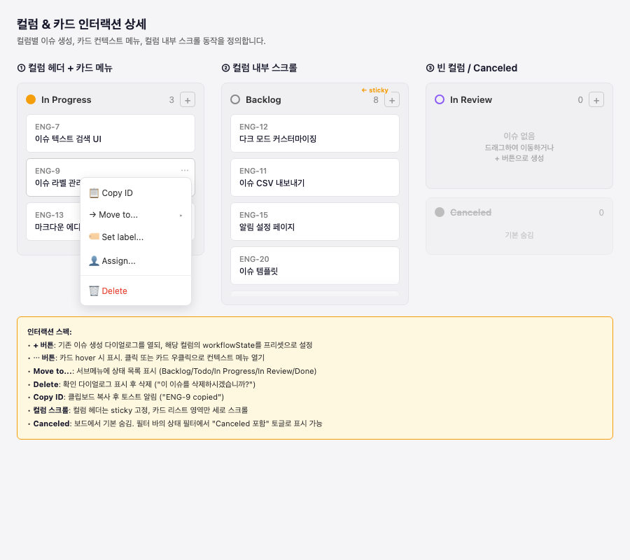

# Kanban Board View Spec

> Issue: [#102](https://github.com/dolgim/dolinear/issues/102)

## Overview

이슈 목록을 워크플로 상태(Backlog, Todo, In Progress, In Review, Done) 별 컬럼으로 나누어 보여주는 칸반 보드 뷰를 구현한다. 기존 리스트 뷰와 토글로 전환할 수 있으며, 드래그 앤 드롭으로 이슈의 상태와 정렬 순서를 변경할 수 있다.

---

## Board Layout

### 구조

- **뷰 토글**: List / Board 전환 버튼. 현재 뷰가 활성 표시
- **필터 바**: 기존 `FilterBar` 컴포넌트 재사용 (Priority, Assignee, Label 필터)
- **컬럼**: 팀의 `workflow_state`를 `position` 순으로 배치. 각 컬럼 헤더에 상태 아이콘 + 이름 + 이슈 수 표시
- **카드**: 이슈 1개 = 카드 1개. `sortOrder` 순으로 정렬

### 카드 구성 요소

| 요소 | 설명 |
|------|------|
| 식별자 | `ENG-7` 형태의 이슈 identifier |
| 우선순위 | Urgent/High 일 때 아이콘 + 텍스트 표시 |
| 제목 | 이슈 title |
| 레이블 | 컬러 뱃지로 표시 |
| 담당자 | 아바타 (이니셜) |

---

## Interactions

### 1. Drag & Drop — 컬럼 간 상태 변경

카드를 다른 컬럼으로 드래그하면 드롭 위치에 파란색 인디케이터가 표시된다. 카드 사이의 원하는 위치에 정확히 삽입할 수 있다 (같은 컬럼 내 정렬과 동일한 UX).

**드롭 동작 스펙:**

- `workflowState`를 대상 컬럼의 상태로 변경 + `sortOrder`를 삽입 위치에 맞게 계산
- 카운트는 optimistic update (드롭 즉시 UI 반영, API 응답 후 확정)
- **ESC 또는 원래 위치 드롭**: 취소 — 원래 위치로 복귀, 상태 변경 없음
- **빈 컬럼에 드롭**: 해당 컬럼의 첫 번째 카드로 삽입 (`sortOrder = 1.0`)

### 2. Card Click — 사이드 피크 패널

카드를 클릭하면 우측에 피크(peek) 패널이 열려 이슈 상세 정보를 표시한다. 보드 뷰를 유지하면서 이슈 내용을 빠르게 확인/수정할 수 있다.

**피크 패널 동작 스펙:**

- 모든 필드(Status, Priority, Assignee, Label) **인라인 편집 가능** — 클릭 시 드롭다운 셀렉터 표시
- **다른 카드 클릭**: 패널 내용 전환 (패널 유지)
- **같은 카드 재클릭**: 패널 닫기
- **X 버튼 또는 ESC**: 패널 닫기
- **보드 빈 영역 클릭**: 패널 닫기
- **URL 연동**: 피크 시 URL 변경 없음 (보드 뷰 URL 유지). 이슈 상세 페이지는 카드 더블클릭 또는 식별자 클릭으로 이동
- **보드 축소**: 피크 패널 열리면 보드 영역이 좁아지고, 컬럼은 수평 스크롤로 대응 (컬럼 너비 고정)

### 3. Column & Card Interactions

컬럼별 이슈 생성, 카드 컨텍스트 메뉴, 컬럼 내부 스크롤 동작을 정의한다.

**인터랙션 스펙:**

- **+ 버튼**: 기존 이슈 생성 다이얼로그(`CreateIssueDialog`)를 열되, 해당 컬럼의 `workflowState`를 프리셋으로 설정
- **... 버튼**: 카드 hover 시 표시. 클릭 또는 카드 우클릭으로 컨텍스트 메뉴 열기
- **Move to...**: 서브메뉴에 상태 목록 표시 (Backlog / Todo / In Progress / In Review / Done)
- **Delete**: 확인 다이얼로그 표시 후 삭제
- **Copy ID**: 클립보드 복사 후 토스트 알림 ("ENG-9 copied")
- **컬럼 스크롤**: 컬럼 헤더는 sticky 고정, 카드 리스트 영역만 세로 스크롤
- **Canceled**: 보드에서 기본 숨김. 필터 바의 상태 필터에서 "Canceled 포함" 토글로 표시 가능

---

## Data Model Reference

### `workflow_state` 테이블

| 필드 | 타입 | 설명 |
|------|------|------|
| `id` | text (PK) | 상태 ID |
| `teamId` | text (FK) | 팀 참조 |
| `name` | text | 상태 이름 (Backlog, Todo, ...) |
| `color` | text | 상태 색상 |
| `type` | enum | `backlog` \| `unstarted` \| `started` \| `completed` \| `cancelled` |
| `position` | integer | 컬럼 표시 순서 |

### `issue` 테이블 (핵심 필드)

| 필드 | 타입 | 설명 |
|------|------|------|
| `workflowStateId` | text (FK) | 현재 상태 → 컬럼 결정 |
| `sortOrder` | real | 컬럼 내 정렬 순서 |
| `priority` | integer | 우선순위 (0=None, 1=Urgent, ...) |
| `assigneeId` | text (FK) | 담당자 |

**인덱스**: `issue_team_state_idx(teamId, workflowStateId)` — 팀+상태 기반 쿼리 최적화

---

## Existing Infrastructure

구현 시 재사용 가능한 기존 컴포넌트/인프라:

| 컴포넌트 | 위치 | 용도 |
|----------|------|------|
| `FilterBar` | `apps/web/src/components/issues/FilterBar.tsx` | 보드 상단 필터 |
| `CreateIssueDialog` | `apps/web/src/components/issue/CreateIssueDialog.tsx` | + 버튼 클릭 시 이슈 생성 |
| DnD 정렬 | 이슈 #95에서 구현 | 같은 컬럼 내 정렬 로직 재활용 |
| `sortOrder` 계산 | 기존 리스트 뷰 | 삽입 위치 기반 sortOrder 계산 로직 |

---

## Completion Criteria

- [ ] 보드 뷰가 워크플로 상태별 컬럼으로 이슈를 표시
- [ ] List / Board 뷰 토글 동작
- [ ] 기존 필터 바가 보드 뷰에서도 동작
- [ ] 드래그 앤 드롭으로 컬럼 간 이동 (상태 변경 + 정렬)
- [ ] 카드 클릭 시 사이드 피크 패널 표시
- [ ] 컬럼 헤더 + 버튼으로 이슈 생성 (상태 프리셋)
- [ ] 카드 컨텍스트 메뉴 (Copy ID, Move to, Delete 등)
- [ ] 컬럼 내부 스크롤 (헤더 sticky)
- [ ] Canceled 상태 기본 숨김 + 토글 표시
